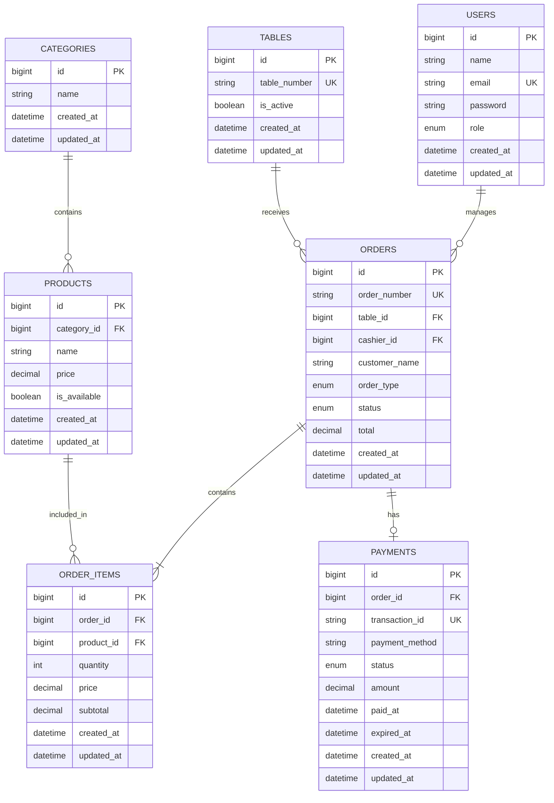
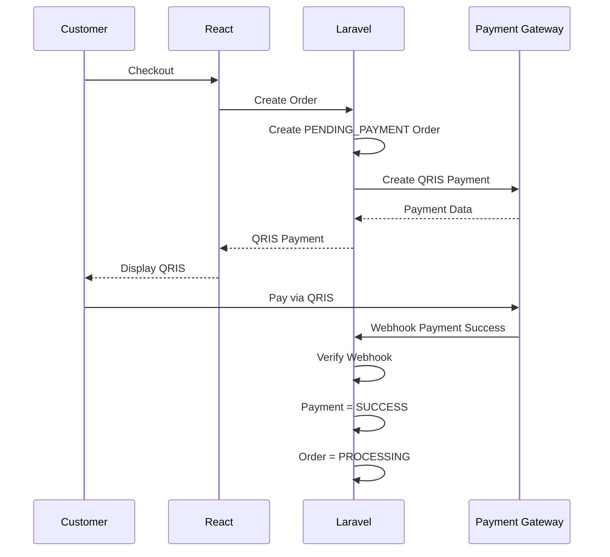
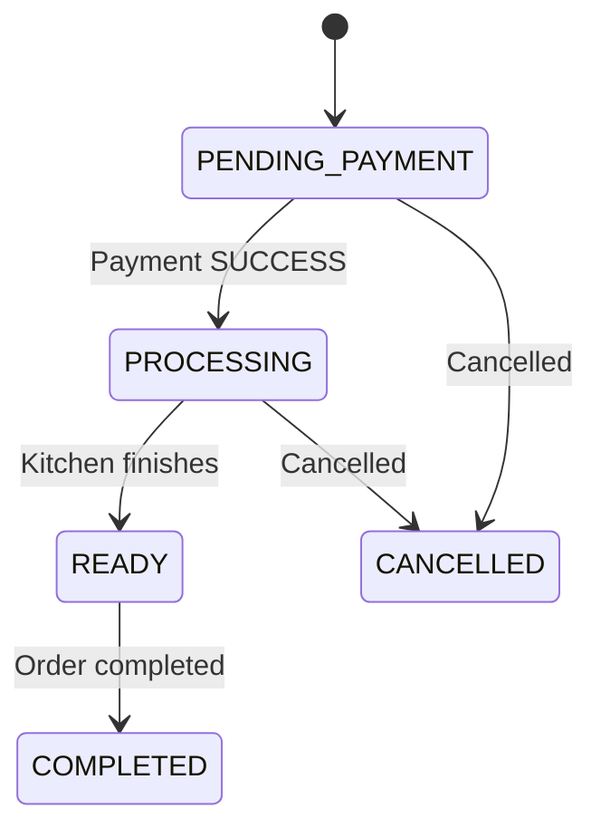

# ERD — QR Ordering System

## 1. Entity Relationship Diagram



---

## 2. Users

`users` menyimpan akun staff yang dapat mengakses Management Outlet.

Role MVP:

```text
ADMIN
CASHIER
```

Kitchen tidak memiliki user account khusus.

### Relationship

```text
User
 ↓
manages
 ↓
Orders
```

`cashier_id` pada order dapat digunakan untuk mencatat staff yang menangani order jika memang diperlukan.

---

## 3. Tables

`tables` menyimpan meja yang tersedia untuk Dine In.

Contoh:

```text
ID    TABLE NUMBER
1     Meja 1
2     Meja 2
3     Meja 3
...
```

Setiap meja memiliki QR Code yang mengarah ke meja tersebut.

### Rule

Customer tidak boleh menentukan `table_id` secara bebas.

Table ditentukan dari QR yang digunakan.

---

## 4. Categories

`categories` digunakan untuk mengelompokkan produk.

Contoh:

```text
Snack
Dimsum
Minuman
Dessert
```

Relationship:

```text
CATEGORY
   │
   └── PRODUCTS
```

Satu category dapat memiliki banyak product.

---

## 5. Products

`products` menyimpan menu yang dapat dipesan customer.

Field penting:

```text
name
price
is_available
category_id
```

### Availability

```text
AVAILABLE
UNAVAILABLE
```

Jika:

```text
is_available = false
```

customer tidak dapat memesan produk tersebut.

Backend tetap harus melakukan validasi availability ketika order dibuat.

---

## 6. Orders

`orders` menyimpan informasi utama pesanan.

Field penting:

```text
order_number
table_id
customer_name
order_type
status
total
```

### Order Type

```text
DINE_IN
TAKE_AWAY
```

### Dine In

```text
order_type = DINE_IN
table_id = required
```

### Take Away

```text
order_type = TAKE_AWAY
table_id = NULL
```

---

## 7. Order Items

`order_items` menyimpan produk yang berada di dalam sebuah order.

Contoh:

```text
Order #ORD-001

Dimsum Ayam    x2
Churros        x1
Es Teh         x2
```

Relationship:

```text
ORDER
  │
  └── ORDER_ITEMS
          │
          └── PRODUCT
```

### Price Snapshot

`order_items.price` menyimpan harga produk ketika order dibuat.

Contoh:

```text
Harga produk sekarang = Rp12.000

Customer order

order_items.price = Rp12.000
```

Jika harga produk berubah menjadi:

```text
Rp15.000
```

order lama tetap menggunakan:

```text
Rp12.000
```

---

## 8. Payments

`payments` menyimpan informasi pembayaran dari payment gateway.

Satu order memiliki maksimal satu payment untuk MVP.

Relationship:

```text
ORDER
  │
  └── PAYMENT
```

### Payment Method

Untuk MVP:

```text
QRIS
```

Namun field `payment_method` tetap dibuat agar sistem dapat dikembangkan di kemudian hari.

### Payment Status

```text
PENDING
SUCCESS
FAILED
EXPIRED
```

---

## 9. Payment Flow



---

## 10. Order State



---

## 11. Important Relationships

### Category → Products

```text
1 Category
   ↓
Many Products
```

### Table → Orders

```text
1 Table
   ↓
Many Orders
```

### Order → Order Items

```text
1 Order
   ↓
Many Order Items
```

### Product → Order Items

```text
1 Product
   ↓
Many Order Items
```

### Order → Payment

```text
1 Order
   ↓
0 or 1 Payment
```

### User → Orders

```text
1 User
   ↓
Many Orders
```

---

## 12. Core Data Flow

```text
CUSTOMER
   ↓
ORDER
   ↓
ORDER ITEMS
   ↓
PAYMENT
   ↓
PAYMENT SUCCESS
   ↓
ORDER PROCESSING
   ↓
KITCHEN
   ↓
READY
   ↓
COMPLETED
```

---

## 13. Important Rules

1. Customer tidak memiliki account.
2. Customer tidak memiliki role atau permission.
3. Staff menggunakan account untuk Management Outlet.
4. Kitchen tidak memiliki login sendiri.
5. Dine In membutuhkan `table_id`.
6. Take Away tidak membutuhkan `table_id`.
7. Harga order dihitung berdasarkan data product di backend.
8. `order_items.price` menyimpan snapshot harga ketika order dibuat.
9. Payment menggunakan payment gateway dengan metode QRIS.
10. Payment success dikonfirmasi melalui webhook.
11. Frontend tidak boleh menentukan payment success sendiri.
12. Payment success otomatis mengubah order menjadi `PROCESSING`.
13. Order `PENDING_PAYMENT` tidak boleh diproses Kitchen.
14. Produk `UNAVAILABLE` tidak boleh dipesan.
15. Backend wajib memvalidasi kembali produk, harga, availability, dan total order.
