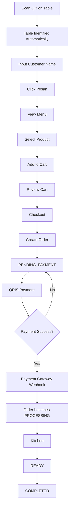
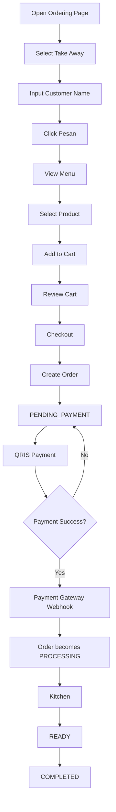
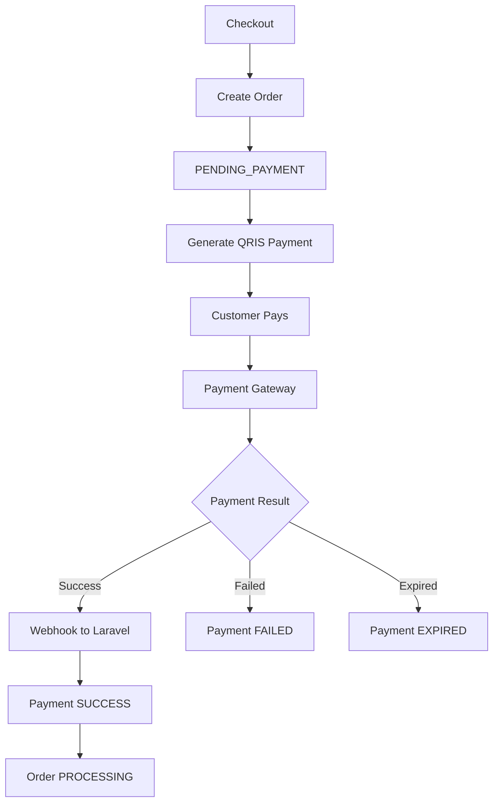
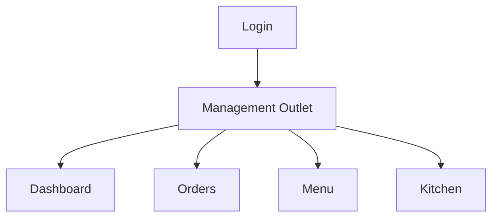
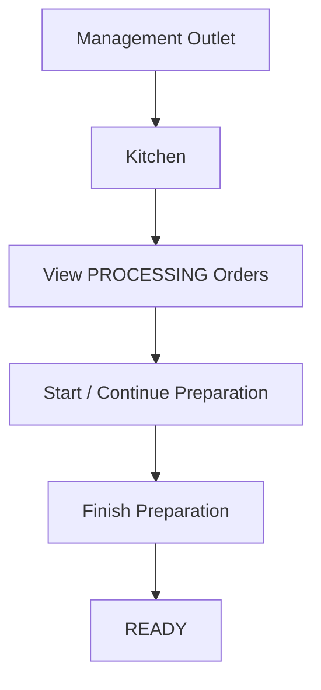
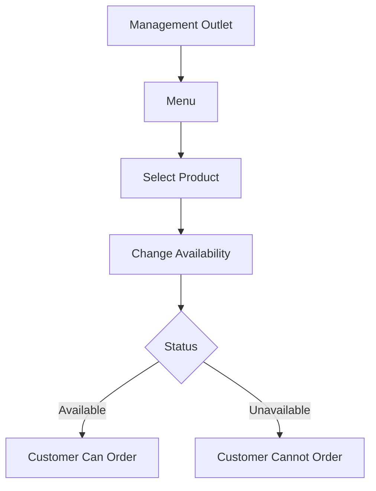

# User Flow — QR Ordering System

## 1. Customer — Dine In

Customer tidak perlu login.



### Detail

1. Customer scan QR yang berada di meja.
2. Sistem mengetahui meja dari QR.
3. Nomor meja ditampilkan otomatis.
4. Customer mengisi nama.
5. Customer menekan tombol `Pesan`.
6. Customer melihat menu.
7. Customer memilih makanan/minuman.
8. Customer memasukkan produk ke cart.
9. Customer melakukan checkout.
10. Order dibuat dengan status `PENDING_PAYMENT`.
11. Customer diarahkan ke pembayaran QRIS melalui payment gateway.
12. Customer melakukan pembayaran.
13. Payment gateway mengirim webhook ke backend.
14. Jika pembayaran berhasil, order otomatis menjadi `PROCESSING`.
15. Order muncul di Kitchen.
16. Setelah selesai dibuat, order menjadi `READY`.
17. Setelah pesanan selesai/diterima customer, order menjadi `COMPLETED`.

---

## 2. Customer — Take Away

Customer juga tidak perlu login.



### Detail

1. Customer memilih `Take Away`.
2. Customer mengisi nama.
3. Customer menekan tombol `Pesan`.
4. Customer melihat menu.
5. Customer memilih produk.
6. Customer memasukkan produk ke cart.
7. Customer melakukan checkout.
8. Order dibuat dengan status `PENDING_PAYMENT`.
9. Customer membayar melalui QRIS.
10. Payment gateway mengirim webhook setelah pembayaran berhasil.
11. Order otomatis menjadi `PROCESSING`.
12. Kitchen memproses pesanan.
13. Order menjadi `READY`.
14. Order menjadi `COMPLETED` setelah selesai/diterima customer.

---

## 3. Customer Payment Flow



### Important Rule

Customer tidak perlu:

- Menekan tombol `Saya sudah bayar`.
- Mengirim bukti transfer.
- Menunggu kasir mengonfirmasi pembayaran.

Payment gateway yang mengonfirmasi pembayaran kepada backend melalui webhook.

---

## 4. Admin / Cashier

Admin/Kasir wajib login.

Setelah login:



### Admin/Kasir dapat:

- Melihat dashboard.
- Melihat daftar order.
- Melihat detail order.
- Melihat status pembayaran.
- Mengelola menu.
- Mengubah produk menjadi `AVAILABLE` atau `UNAVAILABLE`.
- Membuka tampilan Kitchen.

### Admin/Kasir tidak perlu:

- Mengonfirmasi pembayaran secara manual.
- Mengubah order menjadi `PROCESSING` secara manual.

Payment berhasil akan mengubah order secara otomatis melalui webhook payment gateway.

---

## 5. Kitchen

Kitchen tidak memiliki login atau role sendiri.

Kitchen merupakan bagian dari Management Outlet.



Kitchen hanya perlu melihat order yang sudah berstatus:

```text
PROCESSING
```

Order `PENDING_PAYMENT` tidak boleh masuk ke Kitchen.

---

## 6. Complete System Flow

```mermaid
flowchart LR
    A[Customer] --> B[QR / Ordering Page]
    B --> C[Input Name]
    C --> D[Menu]
    D --> E[Cart]
    E --> F[Checkout]
    F --> G[PENDING_PAYMENT]
    G --> H[QRIS]
    H --> I[Customer Pays]
    I --> J[Payment Gateway]
    J --> K[Webhook]
    K --> L[PROCESSING]
    L --> M[Kitchen]
    M --> N[READY]
    N --> O[COMPLETED]
```



---

## 7. Order Status

```text
PENDING_PAYMENT
        ↓
PROCESSING
        ↓
READY
        ↓
COMPLETED
```

Order juga dapat menjadi:

```text
CANCELLED
```

### Status Description

| Status            | Description                                   |
| ----------------- | --------------------------------------------- |
| `PENDING_PAYMENT` | Order dibuat tetapi pembayaran belum berhasil |
| `PROCESSING`      | Pembayaran berhasil dan order sedang diproses |
| `READY`           | Pesanan sudah selesai dibuat                  |
| `COMPLETED`       | Pesanan selesai/diterima customer             |
| `CANCELLED`       | Pesanan dibatalkan                            |

---

## 8. Payment Status

Payment memiliki status sendiri:

```text
PENDING
SUCCESS
FAILED
EXPIRED
```

Payment status dan Order status merupakan dua hal yang berbeda.

Contoh:

```text
Payment
SUCCESS

↓

Order
PROCESSING
```

---

## 9. Product Availability

Admin/Kasir dapat mengubah ketersediaan produk.



Status produk:

```text
AVAILABLE
UNAVAILABLE
```

Backend tetap melakukan validasi ketika customer membuat order.

---

## 10. Important Business Rules

### Rule 1 — Payment

```text
Customer Checkout
       ↓
PENDING_PAYMENT
       ↓
QRIS
       ↓
Payment Success
       ↓
Webhook
       ↓
PROCESSING
```

### Rule 2 — Kitchen

```text
PENDING_PAYMENT
       ↓
Tidak boleh diproses Kitchen
```

```text
PROCESSING
       ↓
Boleh diproses Kitchen
```

### Rule 3 — Dine In

Untuk Dine In:

```text
QR
 ↓
Table ID
 ↓
Order
```

Customer tidak dapat menentukan `table_id` secara bebas.

### Rule 4 — Take Away

Untuk Take Away:

```text
table_id = NULL
```

### Rule 5 — Customer

Customer:

- Tidak login.
- Tidak memiliki role.
- Tidak memiliki permission.
- Tidak dapat mengubah status pembayaran.
- Tidak dapat mengubah harga produk.

### Rule 6 — Staff

Admin/Kasir:

- Wajib login.
- Mengakses Management Outlet.
- Mengelola menu.
- Melihat order.
- Mengakses Kitchen.

### Rule 7 — Payment Gateway

Payment gateway bertanggung jawab memberikan informasi pembayaran kepada backend melalui webhook.

Frontend tidak boleh menentukan sendiri bahwa pembayaran berhasil.
