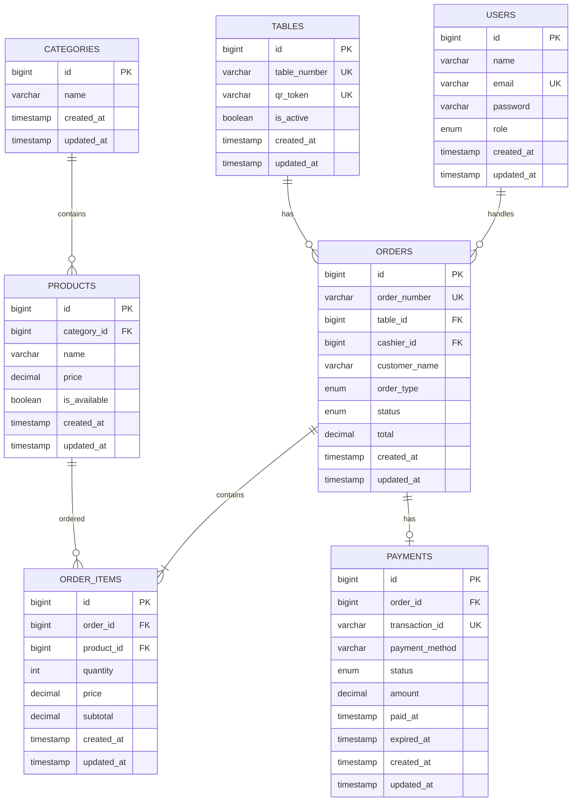

# DB DIAGRAM — QR Ordering System

## ERD



## Tables

### users

Untuk akun Admin dan Kasir.

```text
role:
- ADMIN
- CASHIER
```

Customer tidak perlu akun.

---

### tables

Data meja dan QR masing-masing meja.

```text
table_number
qr_token
is_active
```

QR menggunakan `qr_token` untuk menentukan meja.

---

### categories

Kategori menu.

Contoh:

```text
Dimsum
Snack
Minuman
Dessert
```

---

### products

Data menu yang tersedia.

```text
category_id
name
price
is_available
```

`is_available` digunakan Kasir untuk menandai menu yang sedang tersedia atau habis.

---

### orders

Data utama pesanan.

```text
order_number
table_id
cashier_id
customer_name
order_type
status
total
```

`order_type`:

```text
DINE_IN
TAKE_AWAY
```

Untuk `DINE_IN`, `table_id` wajib ada.

Untuk `TAKE_AWAY`, `table_id` bisa kosong.

`status`:

```text
PENDING_PAYMENT
PROCESSING
READY
COMPLETED
CANCELLED
```

---

### order_items

Detail produk yang dipesan.

```text
order_id
product_id
quantity
price
subtotal
```

`price` menyimpan harga saat order dibuat, jadi perubahan harga menu tidak mengubah order lama.

---

### payments

Data pembayaran dari payment gateway.

```text
order_id
transaction_id
payment_method
status
amount
paid_at
expired_at
```

Payment method untuk MVP:

```text
QRIS
```

Status:

```text
PENDING
SUCCESS
FAILED
EXPIRED
```

Pembayaran yang berhasil akan mengubah order:

```text
PENDING_PAYMENT
        ↓
PROCESSING
```

Perubahan dilakukan melalui webhook payment gateway.

---

## Order Flow

```text
Customer
   ↓
Order
   ↓
Payment QRIS
   ↓
Payment SUCCESS
   ↓
PROCESSING
   ↓
Kitchen
   ↓
READY
   ↓
COMPLETED
```

## MVP Tables

```text
users
tables
categories
products
orders
order_items
payments
```
